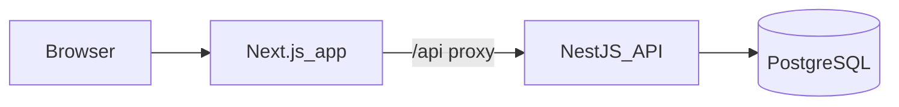

# Stream Pilot

Livestream production planning platform — plan shows, build run sheets, and manage productions.

## Run with Docker (recommended)

```bash
cp .env.example .env
docker compose up --build
```

Stop and remove containers with `docker compose down` (add `-v` to delete the Postgres volume).

- App: http://localhost:3000
- API: http://localhost:3001
- Migrations run automatically on API startup
- Core features work without VAPID keys

**Prerequisites:** [Docker](https://docs.docker.com/get-docker/) only.

No host `pnpm install` required — both Dockerfiles run `pnpm install --frozen-lockfile` during `docker build`.

## Run without Docker

```bash
pnpm install          # required on host for local dev
cp .env.example .env
# Postgres running (e.g. docker compose up postgres)
pnpm migrate:deploy
pnpm dev:api   # terminal 1
pnpm dev:app   # terminal 2
```

**Prerequisites:** pnpm 9.x, Node 20, Postgres.

Adjust `DATABASE_URL` in `.env` for local Postgres (e.g. `localhost` instead of `postgres`).

## Architecture

- **Next.js 15** frontend (`app/`) — App Router, React 19, Zustand state, middleware-protected routes
- **NestJS 11** API (`api/`) — REST, JWT cookie auth, Prisma + PostgreSQL
- **Docker Compose** — `postgres`, `api`, and `app` services (`docker-compose.yml`)

Request flow: browser → Next.js `:3000` → `/api/*` rewrite → NestJS `:3001` (`app/next.config.ts`).



## Authentication

- Login at `/login`, sign up at `/signup`
- JWT stored in httpOnly cookie; `app/src/middleware.ts` redirects unauthenticated users
- API: `POST /auth/login`, `POST /auth/register`, `GET /auth/me`

## App (frontend)

| Route | Purpose |
|-------|---------|
| `/dashboard` | Pipeline analytics, upcoming productions, resource insights |
| `/productions` | List + paginated table |
| `/productions/new` | Two-step wizard (details → run sheet) |
| `/productions/[id]` | Overview, run sheet, assignments |
| `/resources` | Crew + equipment CRUD |
| `/notifications` | In-app + web push settings |

Reusable UI lives in `components/shared/` and `components/ui/`. Feature components are grouped by domain. Client state uses Zustand stores in `app/src/stores/`.

## API (backend)

NestJS feature modules:

- `auth` — register, login, JWT
- `productions` — CRUD, run sheets, crew/equipment assignments
- `crew` / `equipment` — resource inventory
- `dashboard` — aggregated stats for analytics
- `notifications` — in-app notifications, web push, reminder cron

Import `postman/stream-pilot.postman_collection.json` to call endpoints directly.

## Analytics

Dashboard analytics on `/dashboard` (served by `GET /dashboard/stats`):

- Production counts by status
- Crew/equipment totals and unassigned counts
- Top booked crew, upcoming productions, run sheet summary

## Workflows

### Workflow 1 — Productions

1. Sign up or log in at http://localhost:3000
2. On the **Dashboard**, review pipeline analytics, upcoming shows, and resource insights
3. Go to **Productions** → **New Production**
4. **Step 1:** Enter title, description, and event date → **Next**
5. **Step 2:** Add run sheet segments → **Create production**
6. On the production detail page, edit **Overview** or **Run Sheet** tabs and save
7. Return to the list — productions are paginated (10 per page)

### Workflow 2 — Resources & assignments

1. Go to **Resources**
2. **Crew tab:** Add a crew member (name, role, optional contact info)
3. **Equipment tab:** Add inventory (name, category, quantity)
4. Open a production detail page → **Assignments** → **Assign**
5. Select crew and equipment from your inventory → **Save Assignments**
6. Assigned tags appear on the production; remove tags or re-open the picker to update

## Push notifications (optional)

**Optional.** The app runs fully without VAPID keys; placeholder values in `.env.example` are fine for login, productions, resources, and dashboard. Configure VAPID only to demo web push.

Generate VAPID keys once and add them to `.env`:

```bash
npx web-push generate-vapid-keys
```

Copy the output into `VAPID_PUBLIC_KEY`, `VAPID_PRIVATE_KEY`, and set `VAPID_SUBJECT` (e.g. `mailto:you@example.com`).

### Workflow 3 — Notifications

1. Open **Notifications** (bell icon) → **Enable Push Notifications** → allow the browser prompt
2. The bell shows a red badge with your unread count
3. Mark a production **Scheduled** — you get a push immediately. Reminders fire at 24h and 2h before via cron, or trigger manually in Postman (**Notifications → Run Reminders**)
4. Click a notification to mark it read and open the production

Web push works on `localhost` in Chrome, Edge, and Firefox. Production deployments require HTTPS.

## Code structure

```
stream-pilot/
├── app/                  # Next.js frontend
├── api/                  # NestJS backend
├── postman/              # API collection
├── docker-compose.yml
└── .env.example
```

**`api/src/`** — feature modules (`auth`, `productions`, `crew`, `equipment`, `dashboard`, `notifications`), `prisma/`, `common/guards/`

**`app/src/`** — `app/` routes, `components/` (feature + `shared/` + `ui/`), `lib/` API clients, `stores/`, `hooks/`, `middleware.ts`

## Unit tests

Requires host `pnpm install` first (not run inside Docker by default):

```bash
pnpm install
pnpm test        # app (Vitest) + api (Jest)
pnpm test:app
pnpm test:api
```

Coverage focuses on lib/helpers, hooks, and API services.

## Linting & formatting

Requires host `pnpm install`. ESLint (app + api) and Prettier (root):

```bash
pnpm lint          # check
pnpm lint:fix      # auto-fix ESLint issues
pnpm format:check  # check Prettier
pnpm format        # apply Prettier
```
